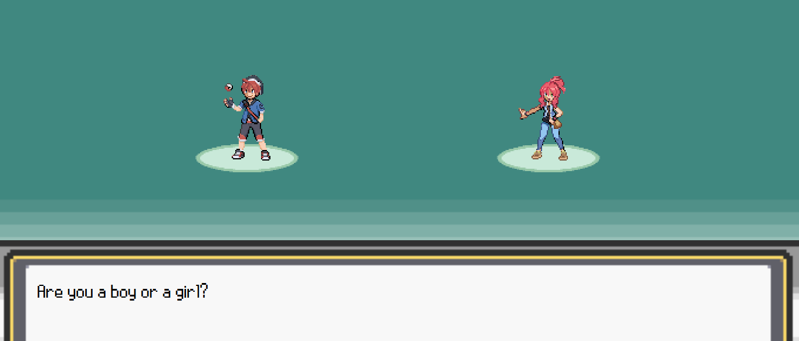
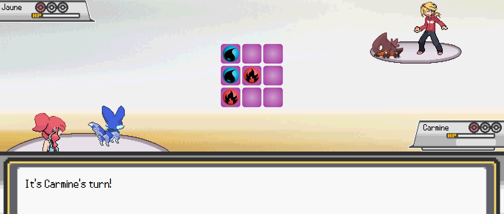

# Toemon - Tic Tac Version

Proyecto creado como ejercicio para GeeksHub Academy.

Pueden abrir el proyecto en Git Hub Pages con el siguiente [Enlace](https://wilberev.github.io/Toemon---Tic-Tac-Version/)

El proyecto, altamente inspirado en los juegos de Pokemon, consiste en un juego de Tic Tac Toe, donde se puede escoger con que personaje queremos jugar y si queremos enfrentarnos contra la Computadora o contra otra persona, ademas de nombrar a nuestro jugador y al personaje de nuestro segundo jugador.

## El juego:

El juego, como se indicaba antes, está inspirado en Pokemon, por lo que empieza con un menú principal y una introducción inspiradas en los de los juegos de Pokemon para las consolas de GameBoy Advance y Nintendo DS, ademas, cuenta con una serie de sprites de personajes y pokemon originales creados para este proyecto.

 * ### Tablero:

El tablero princial del juego sigue la estetica de los juegos de Pokemon, pero, en lugar de tener a los Pokemon combatiendo en medio del escenario, cada uno de ellos, y sus respectivos entrenadores, tiene una sección de la pantalla, donde podremos ver el nombre del personaje y cuantas de sus fichas tiene disponible (Recordemos que en Tic Tac Toe hay un limite maximo de 3 fichas por persona) reflejadas como Pokeballs.

 * ### Personajes:
 
El primer jugador tiene la opción de escoger entre dos personajes, un chico (Crimson) y una chica (Carmine), a quien el jugador puede nombrar como quiera, y ademas tenemos a Azure, el personaje controlado por la computadora, y a Jaune, el personaje controlado por el segundo jugador quien tambien puede ser renombrado. Adicionalmente, cada personaje cuenta con un Pokemon especifico, Thalapix el Zorro de Agua para nuestro personaje principal, Bearition el Oso de Hierba para Azure, y Snaburn, el pequeño dinosaurio de Fuego para nuestro segundo jugador, y las fichas de nuestros jugadores se adaptan al tipo correspondiente a su Pokemon.

 * ### Musica de Fondo:
 
El juego cuenta con dos canciones de fondo durante las partidas, estas varian dependiendo de si jugamos contra la computadora o contra otra persona. Estas canciones pertenecen a la talentosa artista [Miqz](https://soundcloud.com/miqzofficial), y todos los creditos sobre estas van para ella.

 * ### Otras ideas:
 
Originalmente, planeaba introducir escenarios donde el jugador Principal pudiera recorrer un Pueblo y hablar con NPCs, así como acceder al laboratorio del Profesor Ebon, donde podría interactuar con Azure y Jaune, retandolos a partidas de Tic Tac Toe contra la Computadora y un segundo jugador respectivamente. Por falta de tiempo y conocimiento esta idea no pudo ser completamente implementada, por lo que la versión actual directamente nos lleva a escoger contra quien queremos enfrentarnos. 